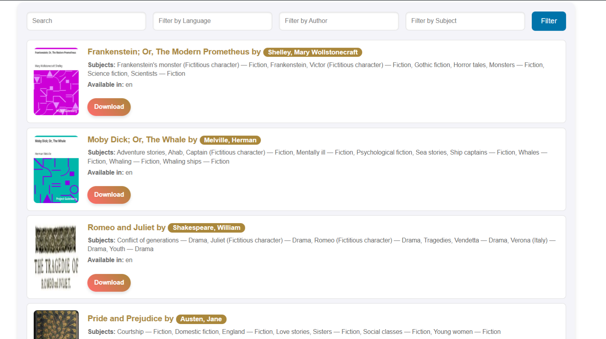
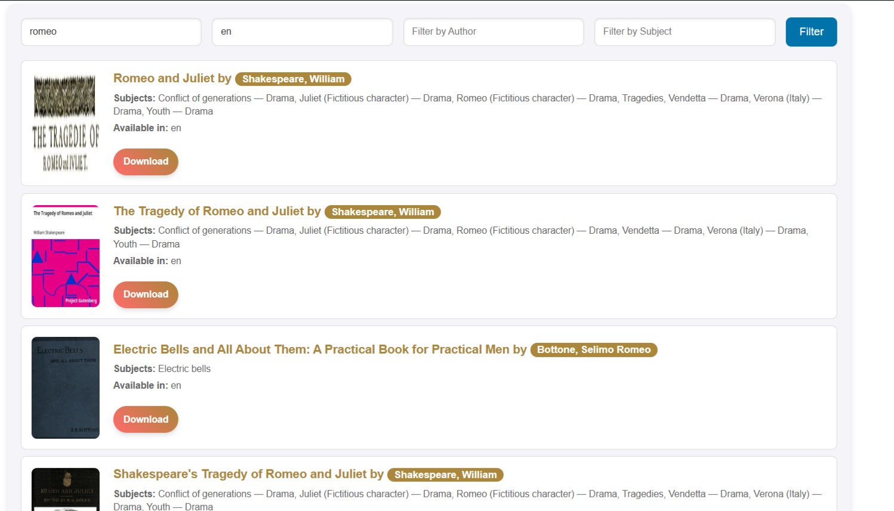
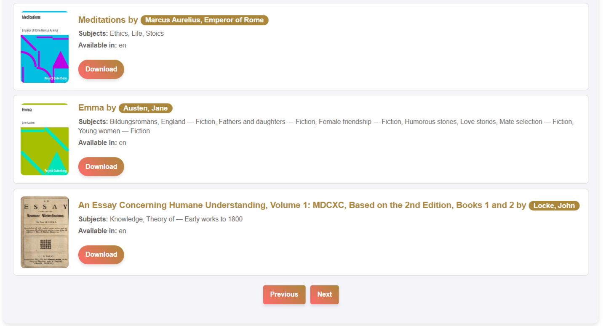

# Books Catalogue

**Books Catalogue** is a WordPress plugin that integrates with the Gutendex API to display a collection of books. The plugin provides features like pagination, filtering by authors, topics, and language, and a user-friendly interface for browsing the book collection.

---

## Features
- Display a collection of books fetched from the **Gutendex API**.
- Filter books by:
  - Author
  - Topic
  - Language
- Pagination for easy navigation through the book collection.
- Responsive and clean design.

---

## Installation

1. Download the plugin files or clone the repository.
2. Navigate to the WordPress directory: `wp-content/plugins/`.
3. Create a folder named `books-catalogue` and upload the plugin files.
4. Log in to your WordPress admin dashboard.
5. Navigate to **Plugins > Installed Plugins** and activate the plugin.

---

## Usage

1. Create a new page or edit an existing one.
2. Add the shortcode `[books_catalogue]` to the page content.
3. Save and view the page to see the book collection.

---

## Screenshots

### Books Display
Books are displayed in a grid layout with their titles, authors, and cover images.

### Filter Form
A simple form at the top of the collection allows users to filter books by author, topic, and language.

### Pagination
Navigate through the collection using "Previous" and "Next" buttons, with the current page displayed.

---

## Customization

- **CSS Styling**: Modify the `assets/css/bca-style.css` file in the plugin directory to customize the appearance.
- **JavaScript Enhancements**: Update the `assets/js/bca-script.js` file to extend or modify client-side functionality.

---

## Technical Details

- **API Integration**: This plugin fetches data from the [Gutendex API](https://gutendex.com/books/) using AJAX.
- **AJAX Handling**: The plugin handles book fetching and pagination via WordPress's `admin-ajax.php`.

---

## Dependencies

- WordPress 5.0 or higher.
- PHP 7.0 or higher.
- Gutendex API access.

---

## Contributing

Feel free to contribute to this project by submitting a pull request or reporting issues. 
